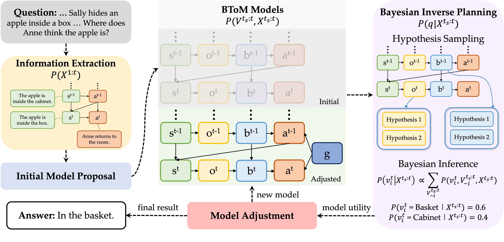

## AutoToM: Scaling Model-based Mental Inference via Automated Agent Modeling
### [Paper](https://arxiv.org/abs/2502.15676) | [Project Page](https://chuanyangjin.com/AutoToM) | [Tweet](https://x.com/chuanyang_jin/status/1894737913499246665)

AutoToM is an automated agent modeling method for scalable, robust, and interpretable mental inference. It achieves SOTA on five benchmarks, produces human-like confidence estimates, and supports embodied decision-making. 



## Example Usage

**Note:** The script must be run from the `model/` directory because it uses relative paths to access data files.

*To run AutoToM on MMToM-QA, with the default settings of reduced hypotheses and backwards inference*: 

    cd model
    uv run python ProbSolver.py --automated --eval_name "MMToM-QA"

*To run AutoToM on ToMi-1st with a specified model input*: 

    cd model
    uv run python ProbSolver.py --eval_name "ToMi-1st" --model_graph "['State', 'Observation', 'Belief']"

If you have activated the virtual environment, you can use `python` directly instead of `uv run`:
    
    cd model
    python ProbSolver.py --automated --eval_name "MMToM-QA"

## Requirements

- Install relevant packages:
    - This project uses `uv` for dependency management. Install dependencies with:
    ``
        uv sync
    ``
    - This will create a virtual environment (`.venv`) and install all required packages from `uv.lock`.
    - To activate the virtual environment manually:
    ``
        source .venv/bin/activate
    ``
    - Or use `uv run` to execute commands within the environment automatically.
- Set your `OPENAI_API_KEY`:
    
    Create a `.env` file in the root directory of the project and add your API key:
    ``
        OPENAI_API_KEY=your-api-key-here
    ``
    
    **Note:** The `.env` file is already included in `.gitignore`, so your API key will not be committed to version control.

## Testing AutoToM with customized questions

Please check out ``playground.ipynb``. Simply replace the story and choices with your customized input to see how *AutoToM* discover Bayesian models and conduct inverse planning!

## Citation

Please cite the paper and star this repo if you find it useful, thanks!

```bibtex
@article{zhang2025autotom,
  title={AutoToM: Automated Bayesian Inverse Planning and Model Discovery for Open-ended Theory of Mind},
  author={Zhang, Zhining and Jin, Chuanyang and Jia, Mung Yao and Shu, Tianmin},
  journal={arXiv preprint arXiv:2502.15676},
  year={2025}
}
```
